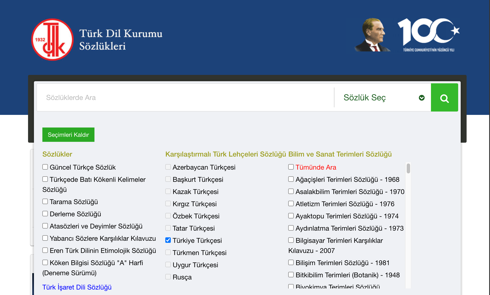
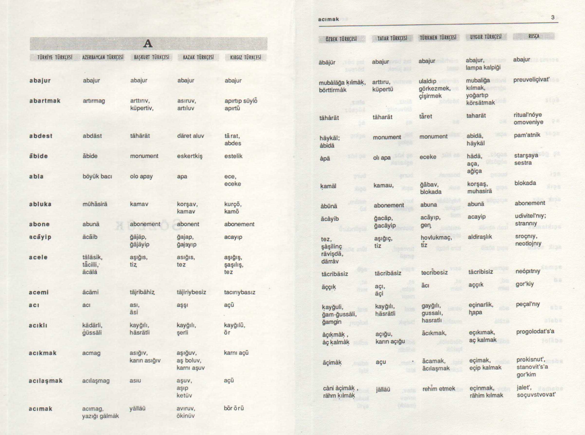

# Karşılaştırmalı Türk Lehçeleri Sözlüğü'nün sayısal ortama aktarılması

Amacım etkileşimli ve karşılaştırmalı Türk lehçeleri sözlüğü yapmaktı.

TDK'nın (Türk Dil Kurumu) sitesinde yer alan [Karşılaştırmalı Türk Lehçeleri Sözlüğü](https://sozluk.gov.tr/) sözcükleri tek tek aramanıza yarıyor.

|  |  |
|---------------------------|---------------------------|

Anladığım kadarıyla bu sözlük Prof. Dr. Ahmet Bican Ercilasun'un komisyon başkanlığını yaptığı, [Karşılaştırmalı Türk Lehçeleri Sözlüğü I](https://openlibrary.org/works/OL15193466W?edition=key%3A/books/OL14515952M)'in sayısal ortama aktarılmış sürümüydü.

Ben de bu sözlüğün Kültür Bakanlığı tarafından 1991'de basılan 2. baskının taranmış pdf biçimini bulup indirdim: ["Karşılaştırmalı Türk Lehçeleri Sözlüğü I.pdf"](./book-pdf/Karşılaştırmalı%20Türk%20Lehçeleri%20Sözlüğü%20I.pdf). Bu birinci kitap kılavuz, ve tabloyu içeriyor, ikinci kitap ise yalnızca [dizin](https://openlibrary.org/works/OL42480158W?edition=key%3A/books/OL57648043M).



Buradaki Türkiye Türkçesi listesini çıkarıp tek tek TDK sitesinde arayacaktım.

Dosyadaki tüm resimleri png olarak çıkardım. Soldaki sayfaları `page_{sayfa-numarasi}_left.png`, sağdakileri `page_{sayfa-numarasi}_right.png` olarak adlandırdım ([rename-left-right.py](./rename-left-right.py)).

Tabloda Türkiye Türkçesi sol sayfanın en solunda yer aldığı için işime yaramayan sağ sayfa dosyalarını bir kenara attım ([delete-right-pages.py](delete-right-pages.py)) ve sol sayfaları Python koduyla kırptım ([crop-left-column.py](./crop-left-column.py)). Bunlar [./book-png-files-cropped](./book-png-files-cropped) dizininde yer alıyor.

Daha sonra bu resimleri yazıya çevirmek için OCR (Optical Character Recognition), ve işlemi hızlandırmak için aynı anda birden fazla dosyayı işleyen çoklu iş parçacığı (threading) kullandım ([make-ocr.py](./make-ocr.py)).

Tüm bu kodlar için ChatGPT'den yardım aldım. Bana çok zaman kazandırdı.

Çıktılar çok kaliteli değildi. Elimle bunları tek tek düzeltip temiz bir liste elde ettim: [sozluk-turkce-dizini.txt](./sozluk-turkce-dizini.txt)

Daha sonra TDK'nin sitesinde listedeki sözcükleri tek tek arayıp sonuçları aldım. Bu işlemi [fetch-words-from-tdk.py](./fetch-words-from-tdk.py) dosyası yapıyor.

Sonuçlar her bir sözcük için bir JSON dosyası olarak [./tdk-sitesinden-sozcukler](./tdk-sitesinden-sozcukler) dizininde yer alıyor:

- [./tdk-sitesinden-sozcukler](./tdk-sitesinden-sozcukler)
  - [abajur.json](./tdk-sitesinden-sozcukler/abajur.json)
  - [abartmak.json](./tdk-sitesinden-sozcukler/abartmak.json)
  - [abdest.json](./tdk-sitesinden-sozcukler/abdest.json)
  - [...]

Tüm JSON dosyalarına `"$kitaptaki_turkce"` adlı bir özellik ekleyip kitapta kullanılan "ḳ", "ā", "ū" gibi özel karakterleri korumaya çalıştım. Örn:

```json
  {
    "$kitaptaki_turkce": "āferin", <-- Ben ekledim
    "lehce_id": "61",
    "asil": "aferin",
    "turkce": "aferin", [...]
```

Sonuçları alma sırasında "alay (askerî)" gibi parantez içeren, birden fazla anlamlı sözcük veya virgülle ayrılmış "biri, birisi" gibi sözcükler hata verdi. TDK da sanırım karakter tarama işlemi yapmış ve bazı sözcüklerde hatalar yapmış. Örneğin "muallak (ta)" sözcüğü "muailak (ta)" olarak kaydedilmiş, ya da "zevḳli (iş)", "zevli(iş) " olarak... Tüm bunları elle indirdim veya düzelttim. Bazen yazım hatasından Türkiye Türkçesinde bulamadığım sözcükleri diğer dillerde aratıp buldum.

**YAP:** Hala eksik sözcükler var: [YAP--eksik-sozcukler.txt](./YAP--eksik-sozcukler.txt)
