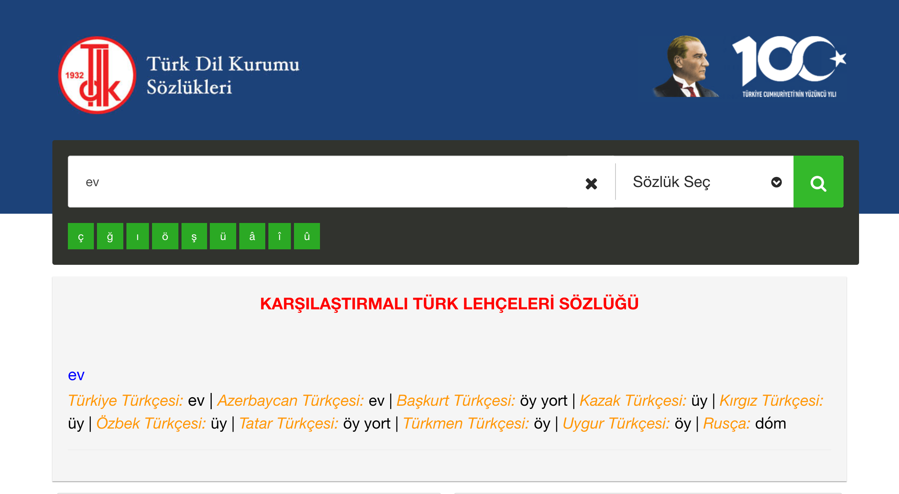

# Karşılaştırmalı Türk Lehçeleri Sözlüğü'nün sayısal ortama aktarılması

Amacım etkileşimli ve karşılaştırmalı Türk lehçeleri sözlüğü yapmaktı.

TDK'nın (Türk Dil Kurumu) sitesinde yer alan [Karşılaştırmalı Türk Lehçeleri Sözlüğü](https://sozluk.gov.tr/) sözcükleri tek tek aramanıza yarıyor.

|  |  |
|---------------------------|---------------------------|

Anladığım kadarıyla bu sözlük Prof. Dr. Ahmet Bican Ercilasun'un komisyon başkanlığını yaptığı, [Karşılaştırmalı Türk Lehçeleri Sözlüğü I](https://openlibrary.org/works/OL15193466W?edition=key%3A/books/OL14515952M)'in sayısal ortama aktarılmış sürümüydü.

Ben de bu sözlüğün Kültür Bakanlığı tarafından 1991'de basılan 2. baskının taranmış pdf biçimini bulup indirdim: ["Karşılaştırmalı Türk Lehçeleri Sözlüğü I.pdf"](./book-pdf/Karşılaştırmalı%20Türk%20Lehçeleri%20Sözlüğü%20I.pdf). Bu birinci kitap kılavuz, ve tabloyu içeriyor, ikinci kitap ise yalnızca [dizin](https://openlibrary.org/works/OL42480158W?edition=key%3A/books/OL57648043M).

Buradaki Türkiye Türkçesi listesini çıkarıp tek tek TDK sitesinde arayacaktım.

Dosyadaki tüm resimleri png olarak çıkardım. Soldaki sayfaları `page_{sayfa-numarasi}_left.png`, sağdakileri `page_{sayfa-numarasi}_right.png` olarak adlandırdım ([rename-left-right.py](./rename-left-right.py)).

Tabloda Türkiye Türkçesi sol sayfanın en solunda yer aldığı için işime yaramayan sağ sayfa dosyalarını bir kenara attım ([delete-right-pages.py](delete-right-pages.py)) ve sol sayfaları Python koduyla kırptım ([crop-left-column.py](./crop-left-column.py)). Bunlar [./book-png-files-cropped](./book-png-files-cropped) dizininde yer alıyor.

Daha sonra bu resimleri yazıya çevirmek için OCR (Optical Character Recognition), ve işlemi hızlandırmak için aynı anda birden fazla dosyayı işleyen çoklu iş parçacığı (threading) kullandım ([make-ocr.py](./make-ocr.py)).

Tüm bu kodlar için ChatGPT'den yardım aldım. Bana çok zaman kazandırdı.

**TODO:** Çıktılar çok kaliteli değildi. Elimle bunları tek tek düzeltip temiz bir liste elde ettim: [tdk.md](./tdk.md)

**TODO:** Daha sonra TDK'nin sitesinde listedeki sözcükleri tek tek arayıp sonuçları aldım. Bu işlemi [tdk.py](./tdk.py) dosyası yapıyor.

## YAPILACAKLAR

* bul: bildircin
* billûr
* ā
* boşaltmak
* bugun
* buz dolabı
